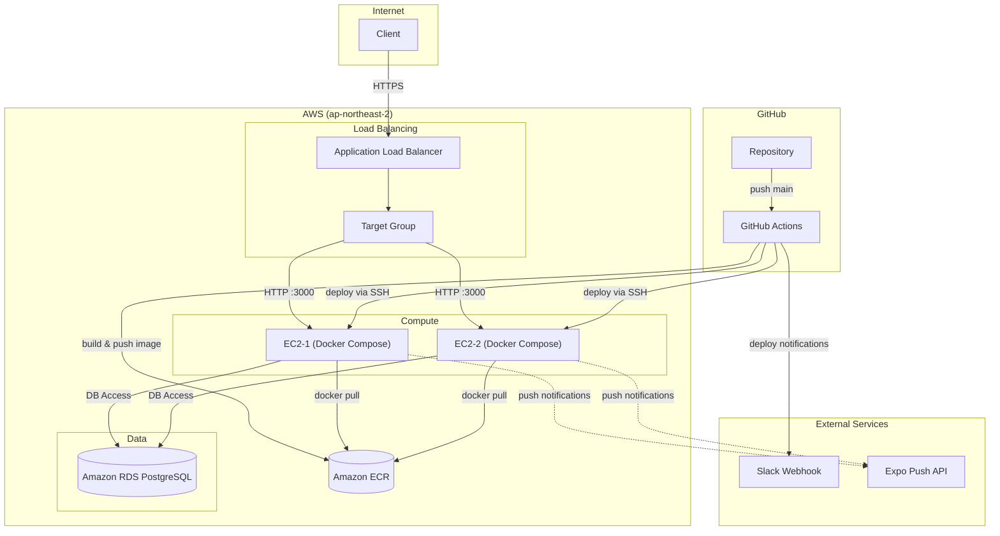
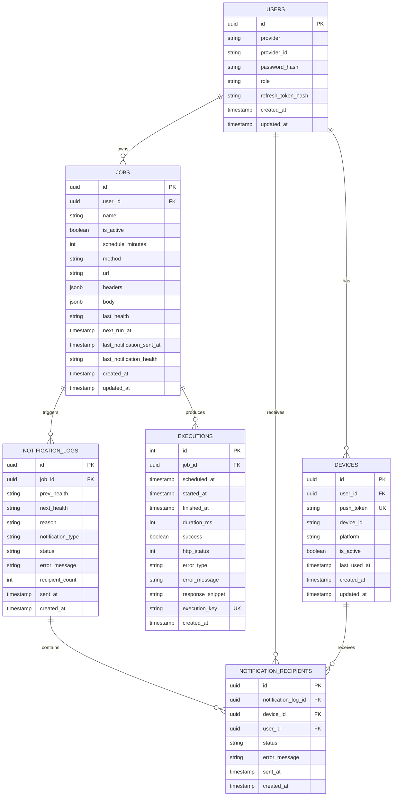

# Helthix Backend

운영 중인 API를 주기적으로 호출하고, 실행 이력 기반으로 서비스 상태를 판단해 푸시 알림까지 연결한 백엔드 프로젝트입니다.  

---

## 프로젝트 요약

- 목적: 배포 후 장애/성능 저하를 자동 감지하고 빠르게 인지
- 핵심 도메인: `Job`(모니터링 대상) / `Execution`(실행 기록) / `Health`(상태 판단)
- 결과물: 인증 API + Job CRUD + 실행 이력 조회 + 자동 상태 전이 알림
- 운영 환경: AWS(EC2 2대, ALB, RDS, ECR) + GitHub Actions 무중단 배포

---

## 담당 구현 범위

- NestJS 기반 모듈형 백엔드 설계 및 구현
- JWT 인증/인가(`USER`, `ADMIN`) 및 공통 에러/응답 규약 정리
- 스케줄러 기반 주기 실행, 중복 실행 방지, 상태 계산 로직 구현
- Expo Push 기반 상태 전이 알림 및 수신자 이력 저장
- Docker 기반 배포 + GitHub Actions로 순차 롤링 배포 파이프라인 구성

---

## 기술 스택

- Language: TypeScript
- Framework: NestJS
- ORM: TypeORM
- Database: PostgreSQL (AWS RDS)
- Infra: AWS EC2, ALB, ECR, RDS
- Scheduler: `@nestjs/schedule`
- Auth: JWT + Passport
- CI/CD: GitHub Actions
- Docs: Swagger

---

## 주요 기능

### 1) 모니터링 Job 관리

- 인증 사용자 기준 Job 생성/조회/수정/삭제
- `scheduleMinutes`, `method`, `url`, `headers`, `body` 설정 가능
- USER는 본인 Job만 접근, ADMIN은 전체 접근

### 2) 실행 이력 수집 및 조회

- 매 실행마다 `Execution` 저장
- `executionKey(jobId + scheduledAt)`로 중복 실행 방지
- Cursor Pagination(`createdAt DESC, id DESC`)으로 안정적인 페이지 조회
- 각 실행에 대해 성능 추이(`improved/stable/degraded`) 계산 제공

### 3) Health 판단 및 상태 전이 처리

- 상태: `NORMAL`, `DEGRADED`, `FAILED`
- 우선순위 기반 판단:
  - `FAILED`: 최근 2회 연속 실패 또는 `nextRunAt + gracePeriod` 초과
  - `DEGRADED`: 최근 평균 지연(절대 임계값 초과) 또는 이전 구간 대비 50% 이상 성능 저하
  - 그 외 `NORMAL`
- 상태 전이 시 `NotificationLog` 기록

### 4) 푸시 알림

- Expo Push API 연동
- 상태 전이 시 푸시 발송 + 수신 결과(`NotificationRecipient`) 저장
- 유효하지 않은 디바이스 토큰 자동 비활성화
- 활성 디바이스가 모두 사라진 사용자의 Job 자동 비활성화

### 5) 공통 API 규약

- 모든 응답을 `meta(requestId, timestamp)` 기반 envelope로 통일
- 전역 예외 필터로 에러 코드/메시지 표준화
- Validation 오류 상세 필드(`error.details`) 제공

---

## API 요약

### Auth
- `POST /auth/signup`
- `POST /auth/login`
- `POST /auth/refresh`
- `POST /auth/logout`
- `DELETE /auth/withdraw`
- `GET /auth/me`

### Jobs
- `POST /jobs`
- `GET /jobs`
- `GET /jobs/:id`
- `PATCH /jobs/:id`
- `DELETE /jobs/:id`

### Executions
- `GET /jobs/:jobId/executions?limit=20&cursor=...`

### Devices
- `POST /devices` (푸시 토큰 등록/업데이트)

### Health
- `GET /health`

---

## 아키텍처 다이어그램

### AWS 인프라 아키텍처



### ERD



---

## 설계/구현 포인트

### 1) 중복 실행 방지 + 경쟁 상태 대응

- `executionKey`에 UNIQUE 제약 적용
- 생성 로직을 트랜잭션으로 감싸 race condition 시에도 중복 방지
- UNIQUE 충돌 시 동일한 도메인 에러로 정규화

### 2) 알림 중복 발송 방지

- Health 갱신 시 Job row를 비관적 락(`pessimistic_write`)으로 보호
- 상태 전이 로그를 먼저 저장하고, 외부 API 호출은 트랜잭션 외부에서 실행
- 발송 실패 시에도 로그 상태(`failed`)를 남겨 추적 가능

### 3) N+1 쿼리 최소화

- Execution 성능 추이 계산 시 개별 조회 대신 배치 조회로 계산
- 페이지 단위 성능 계산 비용을 제어하면서 응답 스키마 유지

### 4) 운영 친화적 배포

- ALB Target Group에서 인스턴스 drain → 배포 → health check → 재등록 순차 수행
- 2대 EC2 순차 배포로 다운타임 최소화
- 배포 시작/실패/성공 이벤트를 Slack으로 자동 알림

---

## 디렉터리 구조

```text
src/
├── auth/                   # 인증/인가
├── jobs/                   # 모니터링 대상 관리
├── executions/             # 실행 이력
├── health/                 # 상태 계산/전이 판단
├── notifications/          # 알림 전략(Expo Push)
├── notification-logs/      # 상태 전이/발송 로그
├── notification-recipients/# 수신자별 결과
├── devices/                # 푸시 디바이스 토큰
├── scheduler/              # 분 단위 스케줄 실행
├── common/                 # 공통 응답/예외/미들웨어
└── config/                 # 환경 설정
```

---

## 개선 예정

- 테스트 코드 추가(Unit/E2E) 및 CI 품질 게이트 강화
- 알림 채널 확장(Email/Slack/Webhook)
- Health 계산 파라미터를 운영 콘솔에서 조정 가능하도록 개선